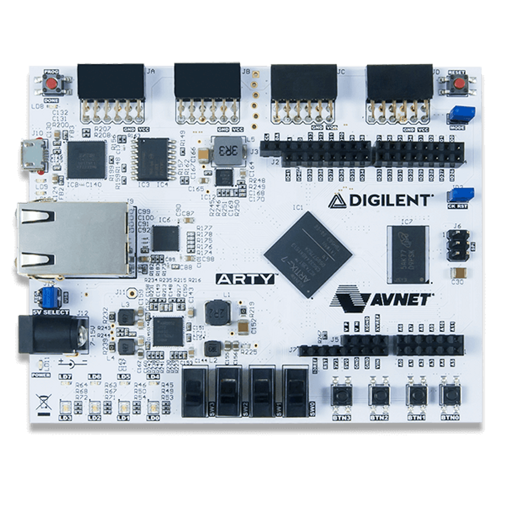

# UART controller

- [UART controller](#uart-controller)
  - [Introduction](#introduction)
    - [Features](#features)
  - [Implementation](#implementation)
    - [UART Core](#uart-core)
    - [APB Uart](#apb-uart)
  - [FPGA Demo](#fpga-demo)
    - [uart\_demo\_arty](#uart_demo_arty)
  - [Reference](#reference)


## Introduction

This repo implements an UART module designed in systemverilog.

It contains the RTL source code, testbench to verify the function, and a device driver written in C.

It also contains demo programs targeting some FPGA board board.

### Features

The UART controller supports the following features (same as SiFive-E300-platform):

- 8-N-1 and 8-N-2 formats: 8 data bits, no parity bit, 1 start bit, 1 or 2 stop bits.
- 8-entry transmit and receive FIFO buffers with programmable watermark interrupts
- 16× Rx oversampling with 2/3 majority voting per bit


## Implementation

### UART Core

The UART core is the main block to performance the UART transaction protocol. It contains 4 RTL files:

| File                      | Description                                     |
| ------------------------- | ----------------------------------------------- |
| src/rtl/uart/uart_baud.sv | Generate sample tick for a given baud rate.     |
| src/rtl/uart/uart_tx.sv   | uart transmit module.                           |
| src/rtl/uart/uart_rx.sv   | uart receive module.                            |
| src/rtl/uart/uart_core.sv | Top level. Instantiate all the 3 above modules. |

Check [uart_core.md](doc/uart_core.md) for implementation details.

### APB Uart

APB Uart design provide a APB Memory Mapped Interface to interact with the Uart core. The memory map is based on SiFive-E300-platform. It contains 2 RTL files:

| File                              | Description                                          |
| --------------------------------- | ---------------------------------------------------- |
| src/rtl/apb_uart/apb_uart.sv      | Top level. Instantiate register module and uart_core |
| src/rtl/apb_uart/apb_uart_fifo.sv | FIFO. A Flop based FIFO                              |
| src/rtl/apb_uart/apb_uart_ctrl.sv | Uart register and control module.                    |

Check [apb_uart.md](doc/apb_uart.md) for memory map and implementation details.


## FPGA Demo

### uart_demo_arty

In this demo program, we take the uart_core design and implemented some test functions on Arty A7-35T FPGA board.

#### Configuration in this demo program

- The baud rate used in the demo program is 115200.
- The stop bit used in the demo program is 1 bit.
- No parity bit is used in the demo program. (Our design does not support parity bit at this point.)

#### Features in this demo program



As shown in the Arty A7 Board picture:

1. RESET button: When pressed, reset the design.

2. BTN0 button: When pressed, send back the most recent byte received from the host machine to the host machine.

3. BTN1 button: When pressed, send the data captured from the 4 SWITCH to the host machine. The upper 4 bits fill be filled with 0.

4. LD4-LD7: The byte received will be displayed on the 4 LED on the board. (Only shows the lower 4 bits of the byte).

#### Run the demo program

A bit stream is already built for user to try the demo program. The bit stream is located in `demo/uart_demo_arty/uart_demo_top.bit`

To download the bit stream to the FPGA: (You need to have vivado installed in you machine)

```shell
cd demo/uart_demo_arty
make pgm
```

To run FPGA flow

```shell
cd demo/uart_demo_arty
make build
```


## Reference

1. SiFive-E300-platform: <https://static.dev.sifive.com/SiFive-E300-platform-reference-manual-v1.0.1.pdf>
