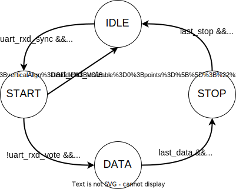
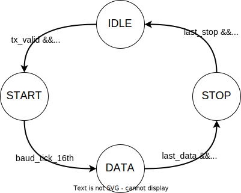

# UART Core

- [UART Core](#uart-core)
  - [Introduction](#introduction)
  - [uart\_baud.sv](#uart_baudsv)
    - [Parameters](#parameters)
    - [IO Ports](#io-ports)
    - [Implementation](#implementation)
  - [uart\_rx.sv](#uart_rxsv)
    - [IO Ports](#io-ports-1)
    - [Implementation](#implementation-1)
  - [Reference](#reference)

## Introduction

Here is an example of Uart Transaction with 0 parity bit and 1 stop bit.

The uart core contains 4 RTL files:

**uart_baud.sv** - Generate sample tick for a given baud rate.

**uart_tx.sv** - uart transmit module.

**uart_rx.sv** - uart receive module.

**uart_core.sv** - instantiate all the 3 above module

## uart_baud.sv

### Parameters

| Name              | Description                     |
| ----------------- | ------------------------------- |
| OVER_SAMPLE_LOGIC | Contains the oversampling logic |

### IO Ports

| Name        | Direction | Width | Description                                       |
| ----------- | --------- | ----- | ------------------------------------------------- |
| clk         | input     | 1     | Clock.                                            |
| rst_b       | input     | 1     | Reset.                                            |
| cfg_div     | input     | 16    | Clock divider counter. cfg_div = F_clk/F_baud - 1 |
| clear       | input     | 1     | Clear the baud counter and start a new  sampling. |
| baud_tick   | output    | 1     | 16x oversampling tick.                            |
| baud_tick6  | output    | 1     | 16x oversampling tick. 6th tick                   |
| baud_tick8  | output    | 1     | 16x oversampling tick. 8th tick.                  |
| baud_tick10 | output    | 1     | 16x oversampling tick. 10th tick.                 |
| baud_tick16 | output    | 1     | 16x oversampling tick. 16th tick.                 |

### Implementation

This module is responsible for generating sampling tick for a given baud rate. It has a clock counter internally to count the time for the next oversampling tick and next baud tick.

Because the clock frequency is unknown and to provide flexibility to support different baud rate, `cfg_div` is used to provide the information on the number of clock cycles for each buad tick (not oversampling tick). When `counter == cfg_div`, `baud_tick` fires and when `counter == cfg_div/16`, `baud_sample` will fire.

Formula to calculate `cfg_div`: `cfg_div = clock_frequency / baud_rate-1 `. (matching with SiFive-E300-platform Uart)

## uart_rx.sv

### IO Ports

| Name      | Direction | Width | Description                                          |
| --------- | --------- | ----- | ---------------------------------------------------- |
| clk       | input     | 1     | Clock.                                               |
| rst_b     | input     | 1     | Reset.                                               |
| cfg_div   | input     | 16    | Clock divider counter. Used by uart_baud module      |
| cfg_rxen  | input     | 1     | RX enable. Enable RX logic                           |
| cfg_nstop | input     | 1     | number of stop bits. 0 - 1 stop bit, 1 - 2 stop bits |
| rx_valid  | output    | 1     | RX data valid.                                       |
| rx_data   | output    | 8     | RX data.                                             |
| uart_rxd  | input     | 1     | UART RX signal                                       |

### Implementation

#### 16x Rx oversampling and 2/3 majority voting

To filtering out the potential noise on the uart_rxd signal, we use 16x Rx oversampling with 2/3 majority voting per bit. Each bit window is divided into 16. We sample the uart_rxd data around the middle of a transaction 3 times at the 6th, 8th, 10th tick of the 16 sampling tick.  The majority value of the 3 values is the final value of uart_rxd in this bit.

### RX state machine

#### State diagram

#### State

| State | Description                                  |
| ----- | -------------------------------------------- |
| IDLE  | IDLE state. Waiting for the start condition. |
| START | Receiving start bit.                         |
| DATA  | Receive data bits.                           |
| STOP  | Receiving stop bit.                          |

#### State transition

| Current State | Next State | Condition                      | Description                                                  |
| ------------- | ---------- | ------------------------------ | ------------------------------------------------------------ |
| IDLE          | START      | !uart_rxd_sync                 | When uart_rxd goes low, we transit to START to sample start condition. |
| START         | IDLE       | uart_rxd_vote                  | When the vote result is high, go back to IDLE state as this is not a start condition. |
| START         | DATA       | !uart _rxd_vote && baud_tick16 | When the vote result is low (true start condition) and we reach the end of the bit. |
| DATA          | STOP       | last_data && baud_tick16       | When we are receiving the last data bit and we reach the end of the bit. |
| STOP          | IDLE       | last_stop && baud_tick16       | When we are receiving the last stop bit and we reach the end of the bit. |

## uart_tx.sv

### IO Ports

| Name      | Direction | Width | Description                                          |
| --------- | --------- | ----- | ---------------------------------------------------- |
| clk       | input     | 1     | Clock.                                               |
| rst_b     | input     | 1     | Reset.                                               |
| cfg_div   | input     | 16    | Clock divider counter. Used by uart_baud module      |
| cfg_txen  | input     | 1     | RX enable. Enable RX logic                           |
| cfg_nstop | input     | 1     | number of stop bits. 0 - 1 stop bit, 1 - 2 stop bits |
| tx_valid  | input     | 1     | TX data valid.                                       |
| tx_data   | input     | 8     | TX data.                                             |
| tx_ready  | output    | 1     | TX ready.                                            |
| uart_txd  | output    | 1     | UART TX signal                                       |

### Implementation

### TX state machine

#### State diagram

#### State

| State | Description                            |
| ----- | -------------------------------------- |
| IDLE  | IDLE state. Waiting for new tx request |
| START | Sending start condition.               |
| DATA  | Sending data bits.                     |
| STOP  | Sending stop bit.                      |

#### State transition

| Current State | Next State | Condition                | Description                                   |
| ------------- | ---------- | ------------------------ | --------------------------------------------- |
| IDLE          | START      | tx_valid                 | Received TX request, sending start bit        |
| START         | DATA       | uart_rxd_vote            | Finished sending start bit, sending data bits |
| DATA          | STOP       | last_data && baud_tick16 | Finished sending data bits, sending stop bits |
| STOP          | IDLE       | last_stop && baud_tick16 | Finished sending stop bits,go back to idle    |

## Reference

1. SiFive-E300-platform: <https://static.dev.sifive.com/SiFive-E300-platform-reference-manual-v1.0.1.pdf>
